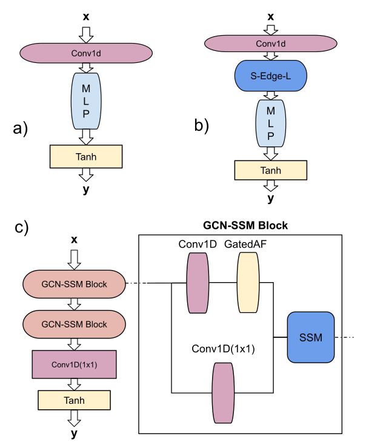
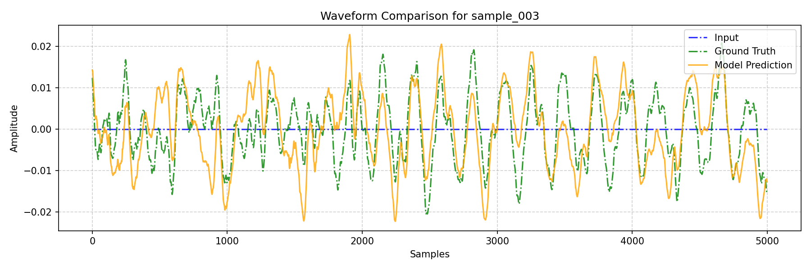
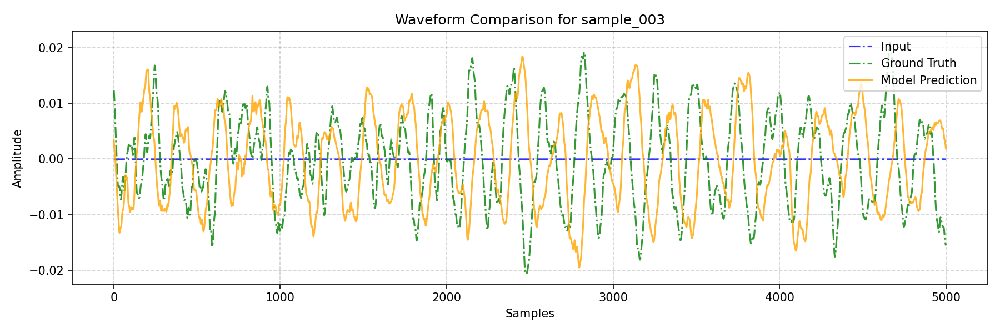
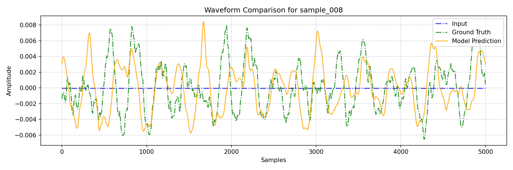

# Audio Examples for "Hybrid Convolutional State-Space Models for Spring Reverb Emulation"

**Author:** Jonas Janser

**[📜 Link to Paper (arXiv)]()** <!-- TODO: Add link to your paper when available -->
| **[💻 Link to Code (GitHub)](https://github.com/Kffeekltsch/spring-ssm)**

---

## Abstract

Modeling analog audio effects like spring reverbs is a long-standing challenge due to the complex and nonlinear behaviors, such as amplitude-dependent transients and long, dispersive reverberant tails. While deep learning has shown promising results, existing paradigms often struggle to capture these characteristics simultaneously. In this paper we propose \textit{GCN-SSM}, a novel hybrid model architecture, combining a Gated Convolutional Network with interleaved State-Space Models. We evaluate the performance with spectral and time-domain losses, and a subjective listening test (MUSHRA~\cite{webmushra}). We show that both components are critical for achieving state-of-the-art perceptual quality. The \textit{GCN-SSM} with interleaved \gls{ssm} layers outperforms the non-hybrid \gls{gcn} as all our test metrics demonstrate. With only 127.4k parameters and real-time capable inference at 5.9 GFlops/s, the \textit{GCN-SSM} is suitable for practical applications on modern CPUs.

---
## Research Pipeline

The diagram below provides a high-level overview of our entire research process, from dataset creation with analog hardware to the final comprehensive evaluation.

  

---

## Model Architectures

Our research is based on a systematic ablation study of four models built from two primary backbones (a simple dilated stack and a Gated Convolutional Network) and an optional IIR-like SSM refinement stage. The diagram below illustrates the signal flow for each model.

  

---
## 1. The Sound of the Analog Hardware

This section demonstrates the fundamental task: transforming a dry input signal into a wet output using the real Electro-Voice EVT 4500 spring reverb unit. These "Wet Ground Truth" files are the targets our models aim to replicate.

| Audio Category | Dry Input Signal | Wet Ground Truth (Hardware) |
| :--- | :--- | :--- |
| **Sample 003** | <audio controls src="audio/references/sample_003_dry_ref.wav"></audio> | <audio controls src="audio/references/sample_003_wet_ref.wav"></audio> |
| **Sample 008** | <audio controls src="audio/references/sample_008_dry_ref.wav"></audio> | <audio controls src="audio/references/sample_008_wet_ref.wav"></audio> |

---

## 2. Full Model Comparison

Here, we compare the performance of all four models from our ablation study against the ground truth. The models are ordered from our main proposal (GCN_SSM) down to the simplest baseline (CONV). Each example includes both waveform visualizations and audio players for comprehensive comparison.

### Example 1: Sample 003

#### Waveform Comparisons

| Model / Reference | Waveform Visualization |
| :--- | :--- |
| **GCN_SSM (Proposed Interleaved)** |  |
| **GCN (Baseline)** |  |
| **CONV_SSM (Sequential Hybrid)** |  |
| **CONV (Baseline)** |  |

#### Audio Comparisons

| Model / Reference | Audio Player |
| :--- | :--- |
| **Dry Input** | <audio controls src="audio/references/sample_003_dry_ref.wav"></audio> |
| **Wet Ground Truth**   *(Target)* | <audio controls src="audio/references/sample_003_wet_ref.wav"></audio> |
| **GCN_SSM (Proposed Interleaved)** | <audio controls src="audio/gcn-ssm/sample_003_pred.wav"></audio> |
| **GCN (Baseline)** | <audio controls src="audio/gcn/sample_003_pred (1).wav"></audio> |
| **CONV_SSM (Sequential Hybrid)** | <audio controls src="audio/conv-ssm/sample_003_pred (2).wav"></audio> |
| **CONV (Baseline)** | <audio controls src="audio/conv/sample_003_pred (3).wav"></audio> |

### Example 2: Sample 008

#### Waveform Comparisons

| Model / Reference | Waveform Visualization |
| :--- | :--- |
| **GCN-SSM** |  |
| **GCN** |  |
| **CONV-SSM** |  |
| **CONV** |  |

#### Audio Comparisons

| Model / Reference | Audio Player |
| :--- | :--- |
| **Dry Input** | <audio controls src="audio/references/sample_008_dry_ref.wav"></audio> |
| **Wet Ground Truth**   *(Target)* | <audio controls src="audio/references/sample_008_wet_ref.wav"></audio> |
| **GCN-SSM (Proposed Interleaved)** | <audio controls src="audio/gcn-ssm/sample_008_pred.wav"></audio> |
| **GCN** | <audio controls src="audio/gcn/sample_008_pred (1).wav"></audio> |
| **CONV-SSM (Sequential Hybrid)** | <audio controls src="audio/conv-ssm/sample_008_pred (2).wav"></audio> |
| **CONV** | <audio controls src="audio/conv/sample_008_pred (3).wav"></audio> |

## 4. Real-Time Streaming Inference Examples

The following examples demonstrate the GCN-SSM model's ability to process long, continuous audio files. The output was generated using a block-based "streaming" method that simulates a real-time audio plugin (VST/AU), proving its suitability for practical applications.

| Category | Audio Player |
| :--- | :--- |
| **Long Dry Input Loop**   *(Continuous audio for streaming test)* | <audio controls src="audio/audio_inference.wav"></audio> |
| **Streaming GCN-SSM Output**   *(Real-time processing simulation)* | <audio controls src="audio/gcn-ssm-stream.wav"></audio> |

---
*For questions, please contact Jonas Janser.*